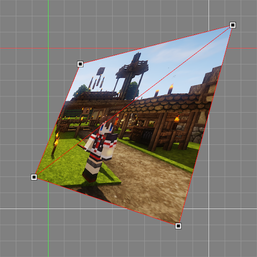

# 行列による矩形の自由変形

Vertex Bufferが持つ座標情報を変形せずに行列のみで自由変形を行う実装

## Page

https://redlily.github.io/training-rect-deformation/index.html

### 操作方法

頂点をドラックで移動、頂点以外をドラックで全ての頂点をまとめて移動

## Licence

MIT Licence
